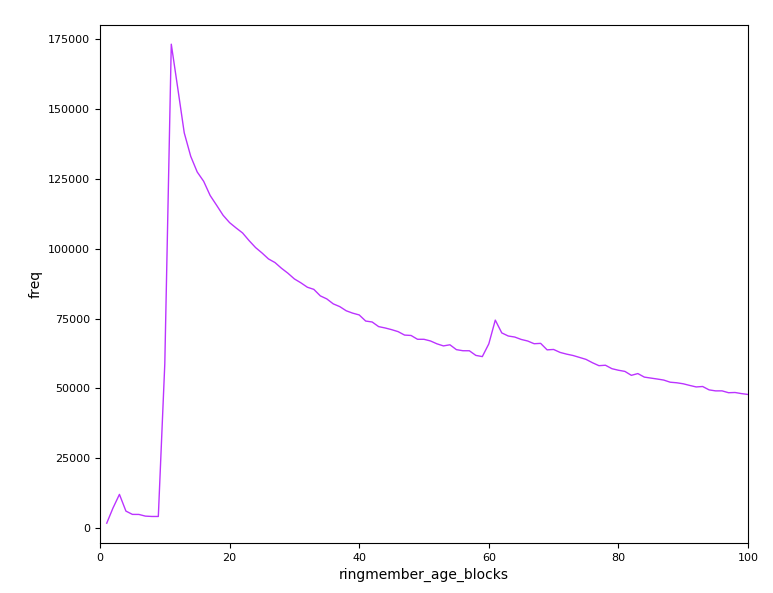

# Ring Member Age Distribution
### Neptune Research, July 2021

In regard to discussion in Monero Research Lab, week of July 12 2021:

    <+secparam[m]> A couple of students of mine have been looking into Monero, we're trying to work out some formal models for how private it is.  We found something a little surprising, though it appears others have seen it too.  If you plot the age of ring members...

# secparam: Cross check

    <+secparam[m]> For what its worth, I'd cross check our data analysis first.  See if we haven't screwed something up parsing the chain or the like.

I was able to accurately recreate secparam's graphs using my own dataset, which is similarly based on extracting and analyzing data from the Monero blockchain, but is a separate implementation from secparam's (I don't have their code or data). This confirms the basis of secparam's data.

For 4 given ranges of blockchain heights, the age in blocks of [each ring member of each transaction input of each transaction of each block] is aggregated, and the distribution is shown. 

Top/blue graph is by secparam, bottom/purple graph is by Neptune. 

## a. secparam1: 800k-1000k


## b. secparam2: 1000k-1200k


## c. secparam3: 1250k-1400k


## d. secparam4: 1400k-1600k


# Peaks
    gingeropolous scrolls wheel trying to spread x axis

According to the dataset, the peaks are:

- secparam1 800k-1000k: 61, 12


- secparam2 1000k-1200k: 13, 62, 3


- secparam3 1250k-1400k: 11, 61, 3


- secparam4 1400k-1600k: 11, 3, 61


Revisiting secparam's message:

    <+secparam[m]> ... If you plot the age of ring members, you get a peak at about 20 blocks. As we understand it, the decoys are sampled from an exp-gamma with shape 19.29, rate 1.61, and the plot of that peaks around 1300 instead. ...

We have identical data, but I cannot find the 20 or 1300.

My guess regarding 20 is that they were looking at the scale in minutes instead of blocks, which they mentioned elsewhere:

    <+secparam[m]> Hrm, that might explain why we get a slightly more spiky plot if we plot by minute vs block number

The first peak is always close to 10, and ```10 blocks * 2 minutes/block = 20 minutes```.

Since they were looking for 1300 though, the distinction between 10 and 20 is not so important in that respect.


# Continued analysis of onchain data
    <+jberman[m]> <UkoeHB "hmm the odd thing is secparam 's"> ya, I think more rigorous analysis taking this into account and comparing to observed distributions over block intervals since this was introduced could provide more clarity. was introduced ~April 2019 

Regarding the new division bug, I continued to plot the output distribution after April 2019 (during v11).


## Improvements
With the freedom to adjust parameters going forward, I considered if any improvements could be made, and found two:


### 1. Use Hard Fork intervals instead of 200k blocks

200k blocks is a good wide range, dividing up the blockchain (current height 2.4M) into 12 sections, but it is also arbitrary. Is there a better interval?

Monero implements regular [scheduled software upgrades](https://github.com/monero-project/monero/#scheduled-software-upgrades), at which time blockchain consensus rules are updated and a new point version of the Monero core software is released. **The consensus rules and software version can change the behavior of ringmember selection, which in turn affects the output distribution.** 

For instance, HF v12 at block height 1978433 introduced a 10 block confirmation time, which banned juvenile ring members. So in an analysis of range 1800000 - 2000000, 2 output distributions with respect to the juvenile ban would be represented.

It is therefore more accurate to analyze output distributions in terms of Hard Fork versions: only set intervals within them.


### 2. Include RingCT outputs only

There are two kinds of transaction outputs in Monero: Pre-RingCT and RingCT. Pre-RingCT is the legacy variant which shows output amounts, while RingCT, introduced at HF v4 (height 1220516) and enforced after HF v6 (height 1400000), is the modern variant which hides output amounts. Pre-RingCT output amounts can be any number (100, 10000, 32580563, anything); RingCT output amounts are always 0.

Ringmembers are selected among the same amount value, because obviously: if you have a Pre-RingCT input of 3 XMR, and you attach some 1 XMR and 2 XMR Pre-RingCT ringmembers to hide it, nothing is hidden. So the ringmembers for a Pre-RingCT input of 3.2580563 XMR are all 3.2580563 XMR, and the ringmembers for RingCT inputs are all 0 XMR. This means **there is an output distribution PER amount.** Each output distribution we have examined so far *has not been a singular distribution but has actually combined ALL of the output distributions for EVERY output amount used in its block range!*

While RingCT is enforced since block 1400000, it is still possible to spend Pre-RingCT outputs in RingCT transactions. Consider this example: https://xmrchain.net/tx/25bad47955e6389f5f2060aed191295aebd7bf70f4475b3ecc857b36cc4ea3e0 There are 3 Pre-RingCT inputs and 2 RingCT inputs. xmrchain shows this graph for the ringmembers time scale:

```
|_**__________*___*_*_*_*___________________________|
|_*_*_*____*____*____*_*_*___________________________|
|_**_*_*_________*_*__*_*___________________________|
|_______________________*___________________*_***|
|_______________________*____________________***|
```

The Pre-RingCT inputs in this transaction, of amounts 0.00004, 0.04, and 0.006, each had their own possible ringmember age distribution, as there will be a different number of outputs available in those exact amounts up to height 1400000 before Pre-RingCT ended. The RingCT inputs had a separate possible ringmember age distribution for ringmembers of amount 0 after height 1220516 when RingCT began. The transition height 1220516 or 1400000 can even be seen on that time scale graph: the Pre-RingCT input distributions take place in basically the left half, the RingCT in the right half. In all, there is not just 1, but 4 output distributions represented in this transaction.

secparam graphs 1 and 2, in the ranges 800k-1000k and 1000k-1200k, only contain Pre-RingCT outputs and include all amount values, of which there were 188817 and 216828 unique amount values in those ranges respectively. The overall trend still emerges though, and that could very well be the objective, not necessarily a problem.

secparam graphs 3 and 4 don't filter amount values either, but as they take place after the introduction of RingCT, the Pre-RingCT distributions merely add noise to the primary RingCT one. In secparam4, of the range 1400k-1600k, the RingCT output distribution is among 2981929 RingCT outputs, while there are 55925 unique Pre-RingCT amounts among 224333 Pre-RingCT outputs: so it is 92.5% RingCT, 7.5% Pre-RingCT.

Altogether, two equally worthwhile outcomes are possible depending on whether the output amount value is filtered or not:
- Don't filter: show the aggregate distribution of all amounts
- Filter: show an individual amount distribution

It CAN therefore more be accurate to include inputs of only *one amount* when running a ringmember age distribution, unless combining them is actually intended. RingCT is most relevant in Monero HF v14, and conveniently there is only one output distribution in RingCT, the distribution among outputs of amount 0.


## v11 RingCT Ringmember Age Distribution (1788720 - 1978433)


Peak: 11, 61




## v12 RingCT Ringmember Age Distribution (1978433 - 2210000)


Peak: 11, 21


Juvenile ring members (< 10 blocks) were banned in this version and no longer appear starting here.

## v13 RingCT Ringmember Age Distribution (2210000 - 2210720; only 720 blocks)


Peak: 17


## v14 RingCT Ringmember Age Distribution (2210720 - 2402699)


Peak: 13


# Summary
- secparam's results for blocks 800k-1600k were cross-checked and validated.
- Peaks in these results were examined in more detail, and the suggested peak 20 was debunked.
- Possible improvements to parameters were found and suggested.
- In retrospect, it is recognized that:
  - secparam 1000k-1200k, 1250k-1400k, and 1400k-1600k overlap multiple hard fork versions respectively, and therefore overlap different versions of blockchain consensus rules and Monero core software.
  - secparam 800k-1000k and 1000k-1200k showed the overall distribution for every Pre-RingCT amount.
  - secparam 1250k-1400k and 1400k-1600k showed primarily a RingCT ringmember age distribution with Pre-RingCT noise.
- Remaining plots, applying the new parameters, were shown.
